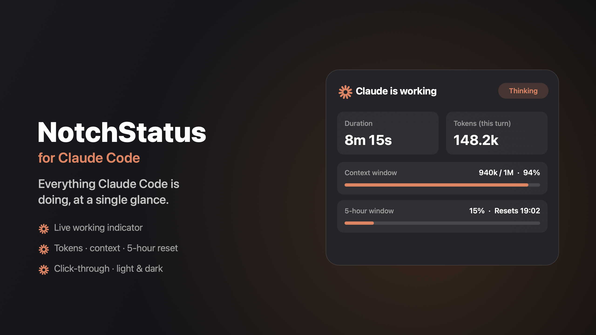

<div align="center">

# ✦ NotchStatus

**See what Claude Code is doing, right around your MacBook notch.**

A native macOS menu-bar utility that turns the notch area into a live status display for [Claude Code](https://claude.com/claude-code): a working indicator, duration, per-turn tokens, context-window usage, the 5-hour limit reset, and a celebratory screen-edge glow when a task finishes.




</div>

---

## What it does

While Claude Code works, a thin animated line glows just under the notch, fused with it, never covering your browser URL bar or content. Click it (or the menu-bar icon) for a frosted-glass panel with everything:

- ⏱️ **Duration**, how long the current turn has been running (freezes when idle)
- 🪙 **Tokens (this turn)**, real per-turn spend
- 📊 **Context window**, `940k / 1M · 94%`, matching Claude's own display
- 🔄 **5-hour limit reset**, computed from your message history (matches Claude's reset time within ~2 min)
- 🌈 **Completion glow**, an Apple-Intelligence-style orange glow sweeps your screen edges when a task finishes, and stays until you click

It also shows a small live timer next to the menu-bar icon, plays a sound + notification on completion, and adapts to **light/dark mode**.

> **Doesn't block anything.** The overlay is fully click-through, folders, menus, the browser URL bar all stay clickable. Only the thin status line and the menu-bar icon are interactive.

## Features

| | |
|---|---|
| 🪟 Frosted-glass panel | Real `behindWindow` blur, see your desktop through it |
| 🎯 Notch-fused line | Sits flush under the notch, full status on click |
| 🌗 Light / Dark | Fully adaptive (semantic colors, system materials) |
| ⚡ Low footprint | Incremental, chunked, background transcript scanning (~5% CPU while working, near-0 idle) |
| 🔣 Custom icon | State-aware menu-bar spark (coral while working) |
| 🖱️ Right-click menu | Toggle the timer, quit |

## Requirements

- **macOS 13 (Ventura) or later**, a MacBook with a notch recommended (the line/panel anchor to the notch; on notchless Macs it anchors under the menu bar)
- **[Claude Code](https://claude.com/claude-code)** installed
- **Python 3**, required by the status hook. macOS does **not** ship Python 3 by default; install it once with `xcode-select --install` (Command Line Tools) or Homebrew (`brew install python`). Most Claude Code users already have it. (NotchStatus shows a one-time alert if it's missing.)

## Get it

NotchStatus is open source, so you have two ways to get it:

- **Build it yourself (free).** See [Build from source](#build-from-source) below. One command, no dependencies.
- **Ready to use (recommended).** Get the pre-built, signed app on **[Gumroad](https://8373761305727.gumroad.com/l/zskuwt)**. It saves you the build and the Gatekeeper setup, and it supports development. Just drag it to Applications.

Either way, on first launch the app auto-installs the Claude Code hooks (see [How it works](#how-it-works)) and asks for notification permission. Allow it to get the completion banner.

> **Gatekeeper:** the app is ad-hoc signed (not notarized), so the first time macOS may say *"NotchStatus can't be opened because it is from an unidentified developer."* After dragging it to Applications, the most reliable fix (works on every macOS version) is one Terminal command:
> ```bash
> xattr -dr com.apple.quarantine /Applications/NotchStatus.app
> ```
> Then open it normally. *GUI alternative:* on **macOS 13-14** right-click the app -> Open -> Open; on **macOS 15+ (Sequoia)** that no longer works; double-click once, then go to **System Settings -> Privacy & Security -> "Open Anyway."* (Once only.)

The app lives in the menu bar, **right-click its icon -> Quit** to exit.

## How it works

NotchStatus reads Claude Code's local state; it never talks to the network.

1. **Hooks**, on first launch the app copies `notch_update.py` to `~/.claude/` and **merges** three hooks into `~/.claude/settings.json` (without touching your existing hooks):
   - `UserPromptSubmit` -> marks "working" + records the turn start
   - `PreToolUse` -> updates the current tool label
   - `Stop` -> marks "done" + records tokens/duration; the app then posts a notification (from **NotchStatus**, with sound) and the screen-edge glow
2. The hook writes a tiny `~/.claude/notch-status.json`.
3. The app reads that file and incrementally scans your session transcript (`~/.claude/projects/**/*.jsonl`) to compute tokens, context window, and the 5-hour window, all on a background thread.

## Privacy & permissions

Everything is **local**, **no network calls, no telemetry** (verify: there isn't a single `URLSession`/socket in the source). NotchStatus only touches files under `~/.claude/`:

- **Reads** your session transcripts (`~/.claude/projects/**/*.jsonl`) to compute token / context / 5-hour numbers. Content never leaves your machine.
- **Writes** a tiny `~/.claude/notch-status.json`, and on first launch **merges** its hooks into `~/.claude/settings.json`. It **backs the file up first** (`settings.json.notchstatus-bak`), only *adds* (never removes your existing hooks), and **refuses to touch a malformed file**.
- Uses a passive global mouse-down monitor **only** to dismiss the completion overlay when you click. It never reads click positions, keystrokes, or any content, and needs **no Accessibility permission**.

## Build from source

```bash
git clone https://github.com/RaacTW/NotchStatus.git
cd NotchStatus
./build-app.sh      # -> NotchStatus.app
# or
./make-dmg.sh       # -> NotchStatus.dmg
```

Single-file Swift app (`NotchApp.swift`), no Xcode project, no dependencies. Built with `swiftc`.

## Uninstall

```bash
# 1) Quit from the menu bar, then:
rm -rf /Applications/NotchStatus.app
rm ~/.claude/notch_update.py ~/.claude/notch-status.json
# 2) Remove the three "notch_update.py" hook lines from ~/.claude/settings.json
```

## Support

If NotchStatus is useful to you:

- ⭐ Star this repo
- 🛒 Get the ready-to-run, signed app on **[Gumroad](https://8373761305727.gumroad.com/l/zskuwt)** (saves the build and Gatekeeper setup, and supports development)

> *Unofficial companion tool. Not affiliated with or endorsed by Anthropic.*

## License

MIT license. See [LICENSE](LICENSE).
